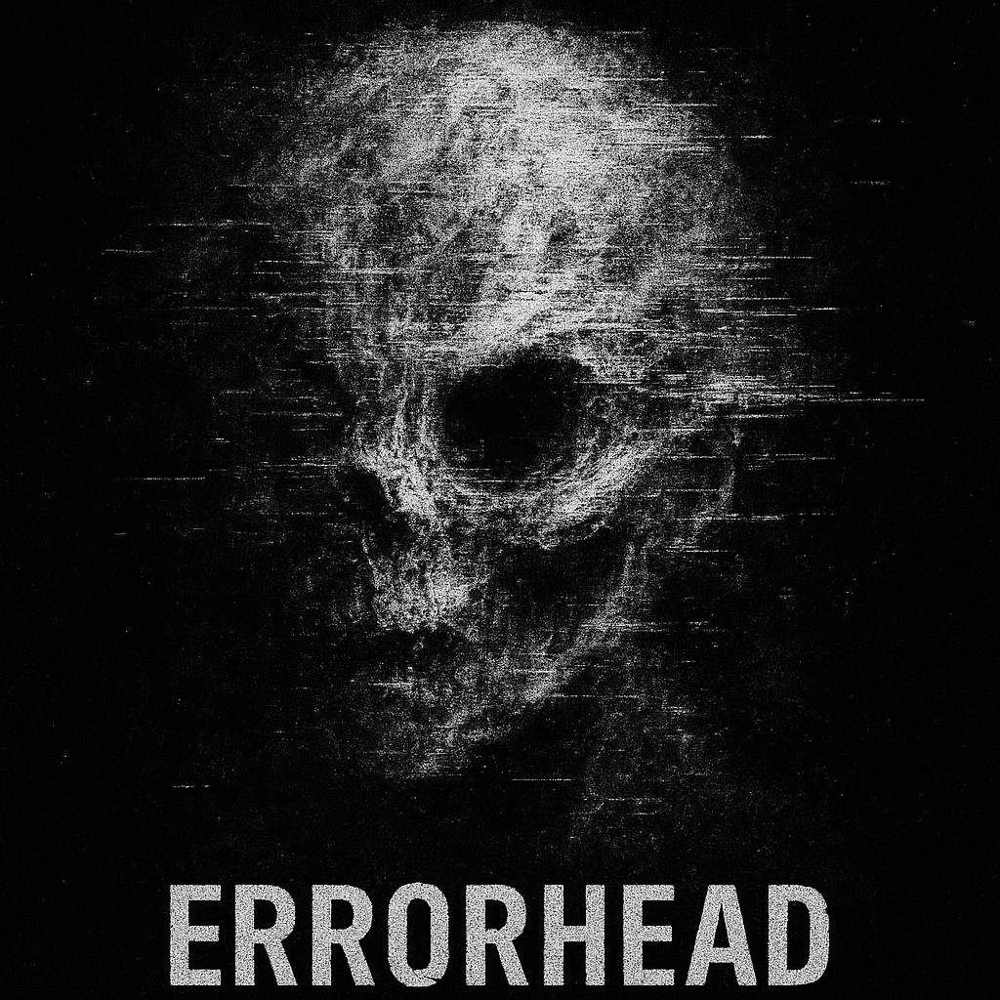

<p align="center">
  
</p>

<h1 align="center">
  <pre>█▓▒░ E R R O R H E A D ░▒▓█</pre>
  <pre>:: V I D E O // G L I T C H // T O O L ::</pre>
</h1>

ERRORHEAD is your conduit to the digital abyss, a Python-based tool for forging unique glitch art from video streams. It melds audio-reactive pulses with shader-based visual distortions, unlocking a spectrum of creative corruption.

---
`>>> SYSTEM_ONLINE <<<`
---

## `// F E A T U R E S //`

*   **`Single Glitch Module:`**
    *   Inject video files (MP4, MOV, AVI).
    *   (Optional) Splice external audio (WAV, MP3) to drive/replace original sound.
    *   `Video Corruption Intensity:` Dial control.
    *   `Audio Mutation Intensity:` (Current mode: Bitcrush) Dial control.
    *   Audio-reactive shader deformations (e.g., `reactive_wave.glsl`).
    *   Export mangled video streams (MP4).
*   **`Live Preview Stage:`**
    *   Real-time video feed processing.
    *   Interactive shader selection & intensity modulation.
    *   Instant visual feedback for effect tuning.
*   **`Interface:`** Built with Tkinter and `ttkbootstrap` for a styled, direct control panel.

## `// F U T U R E _ C O R R U T I O N S //`

*   Batch Processing Matrix.
*   Expanded Audio Mutilation Arsenal.
*   Wider GLSL Shader Library & GUI Management.
*   Granular Glitch Parameter Matrix.

---
`>>> REQUIREMENTS_CHECK <<<`
---

## `// S Y S T E M _ R E Q S //`

*   `Python 3.7+`
*   `FFmpeg:` (Essential for `moviepy` video export. Ensure it's in your system PATH.)
*   Dependencies (see `requirements.txt`):
    *   `numpy`
    *   `opencv-python`
    *   `pydub`
    *   `scipy`
    *   `Pillow`
    *   `moviepy`
    *   `ttkbootstrap`
    *   `moderngl` (implicitly required by `shader_manager`)

---
`>>> INITIALIZE_SEQUENCE <<<`
---

## `// I N S T A L L // & // U S A G E //`

1.  **`CLONE_SOURCE_CODE:`**
    ```bash
    git clone https://github.com/YOUR_USERNAME/ERRORHEAD.git # <-- REPLACE WITH YOUR REPO URL
    cd ERRORHEAD
    ```

2.  **`SETUP_VIRTUAL_ENV (Recommended):`**
    ```bash
    python -m venv venv
    # Windows:
    venv\Scripts\activate
    # macOS/Linux:
    source venv/bin/activate
    ```

3.  **`INSTALL_DEPENDENCIES:`**
    ```bash
    pip install -r requirements.txt
    ```
    *Critical: FFmpeg must be installed & PATH-accessible. Download: [ffmpeg.org](https://ffmpeg.org/download.html)*

4.  **`EXECUTE_PROGRAM:`**
    ```bash
    python main.py
    ```

5.  **`OPERATING_THE_MACHINE:`**
    *   `Single Glitch Tab:`
        *   "🎞️ Video laden": Select input video.
        *   (Optional) "🎵 Audio laden": Select external audio. (Defaults to video's audio).
        *   Adjust "Video-Intensität" & "Audio-Intensität".
        *   "💥 GLITCH EXPORT": Choose save path/name.
    *   `Live Preview Tab:`
        *   "🎞️ Video laden": Select input video.
        *   Use playback controls (▶ Play, ⏸ Pause, ⏹ Stop).
        *   Select shaders from dropdown.
        *   Adjust "Intensität" slider for real-time effect modulation.

---
`>>> JOIN_THE_SIGNAL <<<`
---

## `// C O N T R I B U T I N G //`

Signal injections welcome. To contribute:

1.  Fork the core.
2.  Branch for your modification/feature.
3.  Implement changes.
4.  Transmit Pull Request with clear signal description.

---
`>>> LEGAL_STATIC <<<`
---

## `// L I C E N S E //`

This construct is currently untethered by formal license. Use, modify, distribute freely, but signal source (attribute) if shared. Consider open-source protocols (e.g., MIT) for wider network propagation.

---
`>>> EOF_GLITCH <<<`
---
